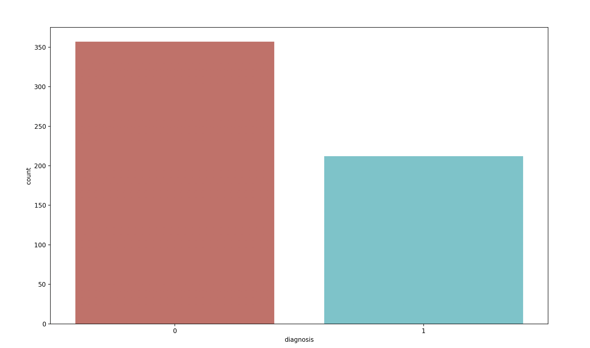
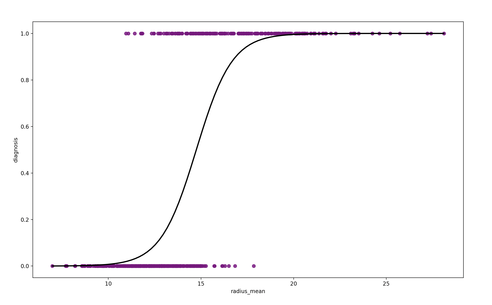

## Project : Binary Logistic Regression Cancer Prediction

<p>
  
  
</p>

### Table of contents :

1. Problem statement
2. Compatible configurations.
3. Installing packages.
4. Steps.
5. Conclusion

## 1. Problem statement :


## 2. Compatible configurations :

* Python 3
* Windows 10
* MacOS
* Linux

## 3. Installing packages :
This program uses the following Python libraries :

```
contourpy 1.2.0
cycler 0.12.1
fonttools 4.47.2
joblib 1.3.2
kiwisolver 1.4.5
matplotlib 3.8.2
numpy 1.26.3
packaging 23.2
pandas 2.2.0
patsy 0.5.6
pillow 10.2.0
pyparsing 3.1.1
python-dateutil 2.8.2
pytz 2024.1
scikit-learn 1.4.0
scipy 1.12.0
seaborn 0.13.2
six 1.16.0
statsmodels 0.14.1
threadpoolctl 3.2.0
tzdata 2023.4


```

## 4. Steps :

### The different steps to build a Logistic Regression Model : 

  * Loading the data
  * Viewing the data
  * Cleaning the data
  * Data splitting into features and target variables
  * Scaling
  * Data splitting into training and testing sets
  * Creating a Logistic Regression Model
  * Training the data
  * Evaluation of the model

## 5. Conclusion :

  * 
  * 

---